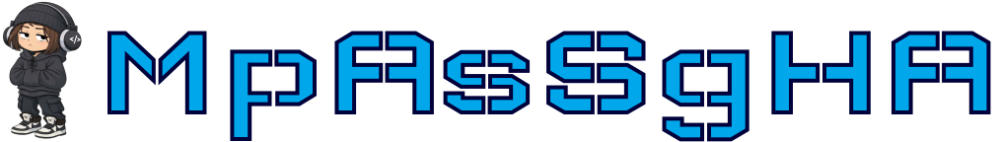

  

  

    
    
    
  

  

  

    
  

---

 

  

- 4th year student at ITMO University and fullstack developer at Yourich Agency
- Interested in frontend development and data engineering
- Open to interesting projects and collaborations
 

---

 

  

<h4> FRONT-END </h4>

<h4> BACK-END </h4>

<h4> DB MANAGMENT </h4>

<h4> EXTRA </h4>

<h4> LANGUAGES </h4>

---

 

  

<table>
<tr>
<td width="full">
<b> <h3> 📝 Course work "Study of attendance of matches RPL" (2023)</h3></b>
<b>Role:</b> Developer  
 
<b>Contribution:</b>  data parsing and preprocessing 
 
 

  
  
  

 
</td>

<td width="full">
<b> <h3> 🚀 Hackathon by GameDEV from VK (2023)</h3></b>
<b>Role:</b> Game developer  
 
<b>Contribution:</b> implementation of the game on the engine GAMEMAKER
 
 

  

 
</td>
</tr>

<tr>
<td width="full">
<b> <h3> 📝 Introductory practice «Study and comparison of means for development of simulation models» (2024)</h3></b>
<b>Role:</b> Developer IM  
 
<b>Contribution:</b> building models in ANYLOGIC
 
 

  

 
</td>

<td width="full">
<b> <h3> 🔭 XIV Congress of Young Scientists of the ITMO (2025)</h3></b>
 
Presentation of the project "Using large language models to aggregate news and create personalized recommendations"
 
 

  

</td>
</tr>

<tr>
<td width="full">
<b> <h3> 💻 Hackathon IT_ONE Cup. Code & Analyst (2025)</h3></b>
<b>Role:</b> Fullstack developer 
 
<b>Contribution:</b> development of a solution on the track "Financial radar: Platform for detecting suspicious transactions"
 
 

  
  
  
  
  
  

 
</td>

<td width="full">
<b> <h3> 📝 Development of personalized sports news aggregator (2026)</h3></b>
 
Full development of the project "Using large language models to aggregate news and create personalized recommendations for sport sphere"
 
 

  
  
  
  

</td>
</tr>
</table>

